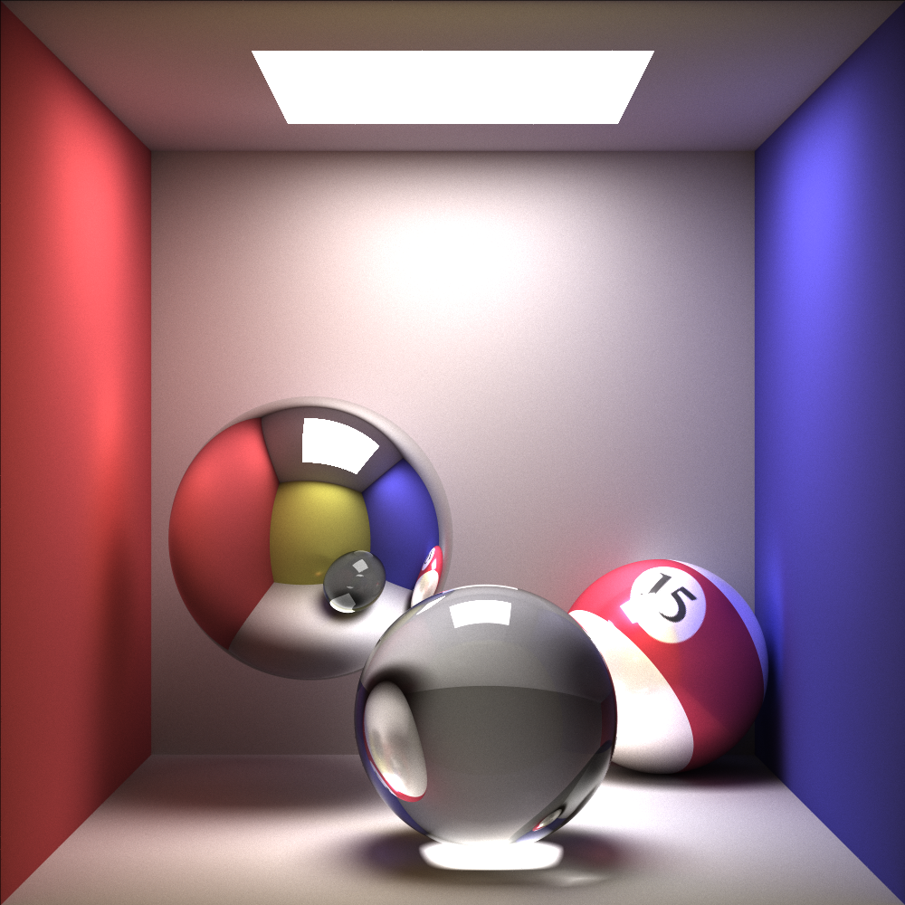

# Naïve Renderer

This repo contains a naïve renderer that failed in the attempt to be photo-realistic. It is the final project for the Computer Graphics course.

Features implemented (listed in order of decreasing difficulty):

- Monte-Carlo-based path tracing
- Reflection, refraction, and diffusion
- Spherical texture mapping
- Image-based lighting (with strange artefacts)
- Anti-aliasing and depth-of-field

The following are some carefully-chosen above-average pictures rendered by this renderer:

- Cornell box with mirror, glass, and textured glossy spheres: 

- Cornell box with mirror, glass, and metallic spheres: 

- Cornell box demonstrating depth-of-field effect: 

- Environment lighting using image-based lighting (with obvious artefacts) that took the least rendering time but looked the most impressive: 

#### References:

- Daniel Ritchie, Lita Cho. The Monte Carlo Project - A Path Tracer. http://web.stanford.edu/~dritchie/path/index.html.
- Scratchpixel. Introduction to Shading: Re ection, Refraction (Transmission) andFresnel. http://www.scratchapixel.com/lessons/3d-basic-rendering/introduction-to-shading/reflection-refraction-fresnel.
- Scratchpixel. The Phong Model, Introduction to the Concepts of Shader,Re ection Models and BRDF. http://www.scratchapixel.com/lessons/3d-basic-rendering/phong-shader-BRDF.

